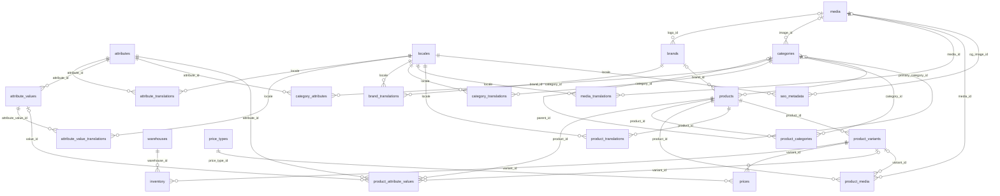
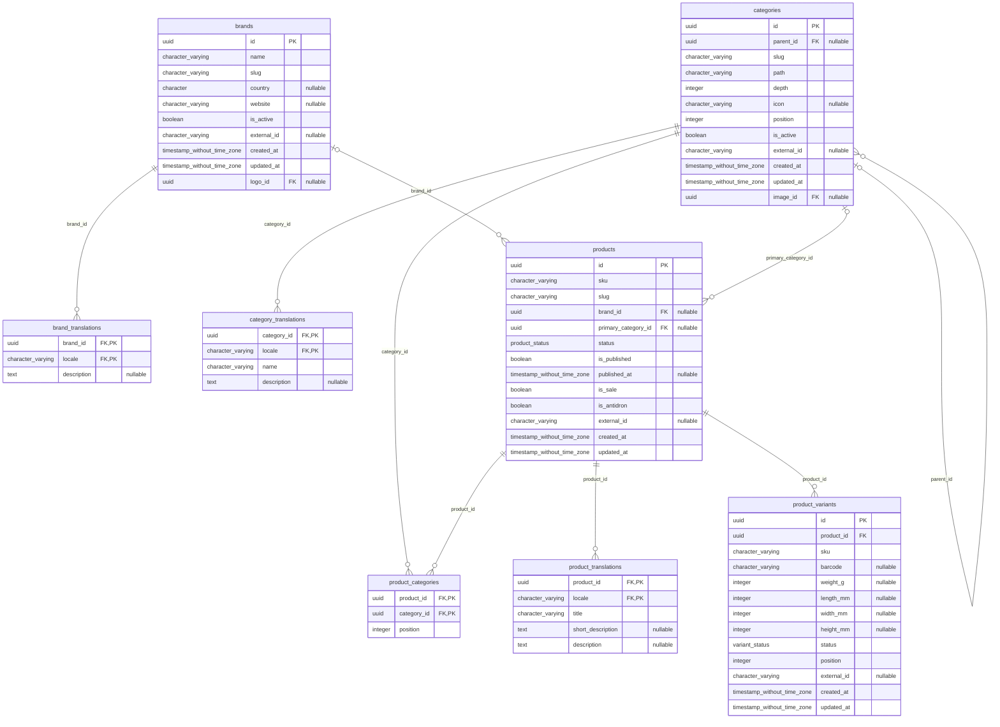
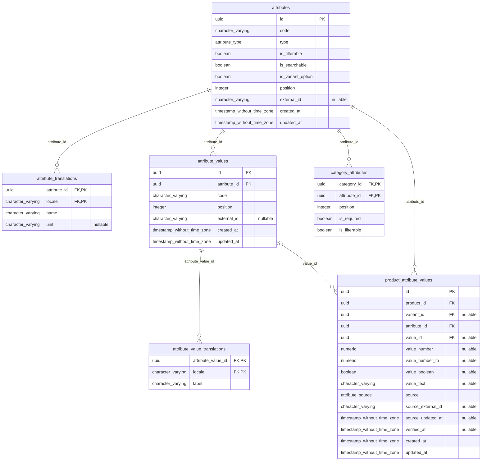
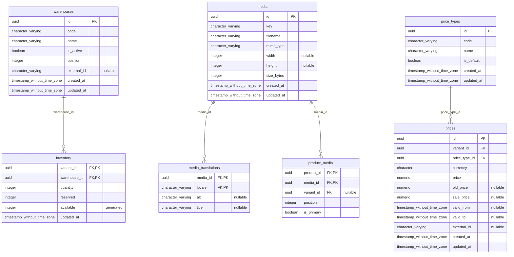
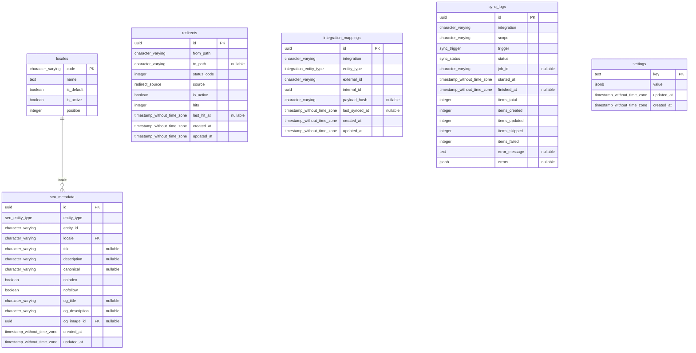

# ERD — схема бази даних

> Згенеровано з живої схеми PostgreSQL командою `npm run db:erd` — не редагувати вручну.
> Джерело правди — `apps/api/prisma/schema.prisma` і міграції. PK/FK/UK — ключі; `generated` — обчислювана колонка.

## Звʼязки між усіма таблицями

## Каталог: категорії, бренди, товари

## Атрибути

## Ціни, склад, медіа

## SEO, редиректи, інтеграції, службові

